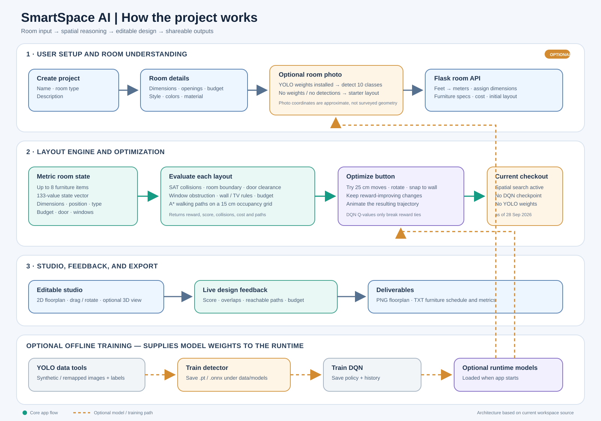
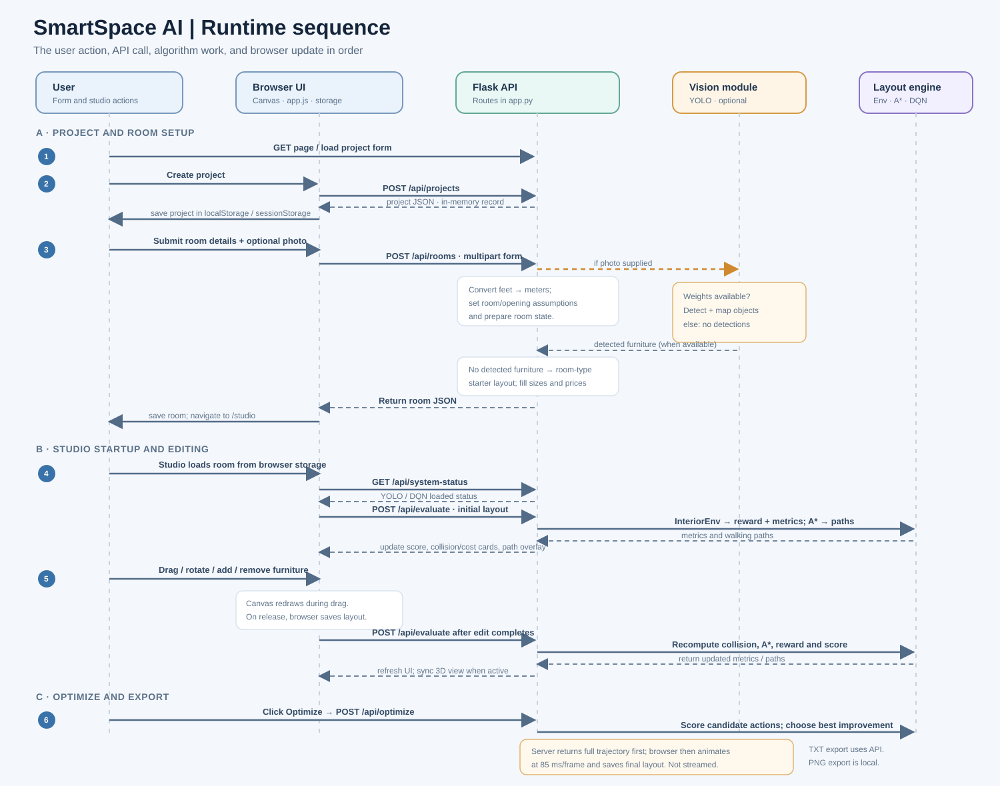

# SmartSpace AI — Workflow and Technical Analysis & Architecture (TA) Report

**Purpose:** A shareable explanation for project members and a presentation aid for the project guide.  
**Scope:** This report describes the top-level project in this workspace and reflects the files present on **28 September 2026**.



## 1. Project in one minute

SmartSpace AI is a browser-based interior layout planning prototype. A user enters room dimensions, budget, and preferences, then opens an editable 2D/3D studio. The backend represents furniture in metric coordinates, checks layout quality, and can propose a sequence of small layout changes. A YOLO vision module can seed furniture from a room image when compatible trained weights are installed. Otherwise the application uses a room-type starter arrangement. The finished layout can be exported as a text specification and a 2D image.

The project's key idea is to combine a friendly design interface with measurable spatial checks: furniture overlap, room boundaries, door access, window obstruction, circulation, selected placement preferences, and cost.

## 2. User workflow

1. **Create a project.** The user enters a project name, room type, and description. The browser sends these to `POST /api/projects`.
2. **Describe the room.** The user supplies length, width, and height in feet; door and window counts; budget; style, colors, material, and an optional JPG/PNG room photo.
3. **Prepare the initial layout.** The server converts dimensions to meters and creates door/window assumptions. If usable detections are available, detected objects seed the furniture list. If not, a starter furniture list is selected from the room type. Missing furniture sizes and prices are filled from `config.py`.
4. **Open the studio.** The browser stores the room data and navigates to the studio. The user can load a preset, edit furniture in the 2D plan, switch to 3D, and ask for a fresh quality evaluation.
5. **Evaluate or optimize.** Manual edits call `POST /api/evaluate`. The Optimize button calls `POST /api/optimize`, which checks candidate actions and returns a step-by-step trajectory for the browser to animate.
6. **Review and export.** The user reviews the score, collisions, circulation, and estimated cost. The studio can download a text design specification and a PNG floorplan snapshot.

### Optional model preparation workflow

- **YOLO:** Create or populate the dataset, generate synthetic examples and/or remap labelled data, then run `vision/dataset_tools/train_yolo.py`. The resulting `.pt` or `.onnx` weights are placed under `data/models` and loaded when the Flask application starts.
- **DQN:** Run `engine/train_dqn.py` to train and save a `dqn_policy.npz` checkpoint and training history. The Flask application loads a compatible checkpoint at startup.
- These are development/training workflows; they are separate from starting the web application with `python app.py`.

## 3. Architecture at a glance

| Layer | Main files | Responsibility |
|---|---|---|
| Web pages and API | `app.py`, `templates/` | Serves landing, project, room-details, and studio pages; accepts form/API requests and returns JSON or downloads. |
| Browser application | `static/js/app.js` | Loads room state, calls APIs, updates metrics, animates optimizer steps, and manages browser-side layout state. |
| 2D / 3D presentation | `static/js/floorplan_canvas.js`, `static/js/room_3d.js` | Draws the editable floorplan and 3D room; renders furniture, paths, and user interactions. The 3D viewer uses Three.js from a CDN. |
| Domain configuration | `config.py` | Defines the ten object classes, dimensions, estimated costs, placement rules, and sample rooms. |
| Vision | `vision/yolo_model.py`, `vision/detector.py` | Loads optional YOLO weights, detects objects, draws labelled boxes, and approximates detections as metric room objects. |
| Layout environment | `engine/interior_env.py` | Encodes a room state, applies discrete furniture moves, evaluates layout rules, and produces metrics. |
| Geometry and circulation | `engine/spatial_utils.py`, `engine/astar_planner.py` | Checks oriented-rectangle collisions and room containment; searches for door-to-furniture paths on a grid. |
| Layout agent and training | `engine/dqn_agent.py`, `engine/train_dqn.py` | Defines the Q-network/checkpoint handling, greedy improvement trajectory, and offline DQN training loop. |
| Vision data tools | `vision/dataset_tools/` | Creates dataset structure, produces synthetic labelled examples, remaps labels, and trains/exports a detector. |

**Request path:** Browser → Flask route in `app.py` → vision and/or layout engine → JSON response → browser re-renders the plan and metrics.

## 4. What the AI and spatial engine do

### Vision path

The detector supports Ultralytics `.pt` weights and ONNX Runtime `.onnx` weights. It recognizes the configured classes `bed`, `sofa`, `chair`, `table`, `wardrobe`, `desk`, `tv`, `cabinet`, `door`, and `window`. Detections carry class, confidence, and normalized image bounding boxes. The extractor maps image centers into approximate room x/y coordinates using the room dimensions, assigns standard furniture dimensions and costs, and makes an annotated image for the interface.

This is a rough image-to-floorplan estimate: a single perspective photo is not calibrated to recover exact depth, scale, rotation, or full room geometry. In the main room-creation route, the form's door count is accepted but one default door is constructed, and windows are placed using the supplied count along a default wall. The separate `/api/detect` route can return inferred opening data, but `/api/rooms` currently uses only its detected furniture and does not apply detected door/window positions.

### Layout evaluation

`InteriorEnv` stores up to eight furniture items. Its state has 133 numeric values: room context and door position plus per-item normalized position, dimensions, rotation, class encoding, and placement flag. The action output has 48 slots (eight furniture slots × six move types): move 25 cm along either room axis, rotate by 90°, or snap to the closest wall.

The active reward checks in `evaluate_layout()` include:

- oriented furniture overlap using the Separating Axis Theorem (SAT);
- furniture extending beyond the room boundary;
- interference with the assumed door clearance;
- wardrobe/cabinet overlap with window areas;
- wall proximity for furniture types marked as wall-preferring;
- sofa-to-TV viewing distance;
- whether A* finds a route from the door area to furniture;
- estimated furniture cost over the entered budget.

The UI's 0–100 ergonomics score is a summary metric derived from selected violations and circulation. It is distinct from the weighted reward used to compare candidate moves. The current objective does not score every preference in the form: style, colors, and material are stored as room metadata, and a desk-by-window daylight bonus is described in configuration/readme material but is not currently applied in `evaluate_layout()`.

### Optimization behavior

The optimizer tries possible item/action combinations, keeps only moves that improve the current total reward, and repeats until it reaches its step limit or no improving move remains. This gives the interface a trajectory to animate. A compatible trained DQN checkpoint supplies Q-values to break ties between equally rewarded candidates. Without a checkpoint, spatial reward search still works; it does not require YOLO or a trained DQN file.

This is a local greedy search, not a guarantee of the globally best floorplan. It improves the supplied starting arrangement, so the starting furniture list and room assumptions matter.

### The optimization algorithm, step by step

For the current layout, the engine evaluates a weighted reward. In simplified notation, the implemented terms are:

```text
reward = -15 × collisions
         -20 × boundary-violation distance (m)
         -25 × door interferences
         -10 × window blockages
         + 2 × wall-alignment score
         + 1.5 × sofa/TV distance score
         +12 × circulation ratio
         - 5 × (cost over budget per ₹1,000)
```

The sofa/TV distance score gives +2 for a pair inside the configured viewing range and −1 otherwise. Wall-alignment score adds +1 when a wall-preferring item is within 20 cm of a wall, and penalizes it by half its wall distance otherwise. Window blockage checks apply to wardrobes and cabinets. The score shown as **Ergonomics %** is calculated separately from reward; it starts at 100 and subtracts capped penalties for collisions, door blocks, boundary violations, and unreachable circulation, with a small wall-alignment adjustment.

At each optimization step, the optimizer:

1. Encodes the current room as the 133-value state and computes the current reward.
2. Tries each legal item/action pair from a copy of the same starting layout: move an item 25 cm along either axis, rotate it by 90°, or snap it to the closest wall.
3. Recalculates the full layout reward for every candidate. Collision checks use oriented rectangles and SAT; A* checks whether each furniture target can be reached from the door on a 15 cm grid.
4. Discards candidates that do not improve the current reward. From the remaining candidates, selects the highest-reward move. If several tie, Q-values from the DQN select among those tied moves.
5. Commits that one move, records its layout and metrics, then repeats until the step limit or until no improving move exists.

The endpoint defaults to 25 steps and caps requests at 100. It returns the complete trajectory in one response. The browser then animates the returned frames at about 85 ms per frame; this is a client-side animation, not a streamed server response.

### How the optional DQN is trained

The offline training script repeatedly resets the environment to the built-in master-bedroom preset. During training, the agent selects actions with an epsilon-greedy policy (random exploration early, increasingly often choosing the highest predicted Q-value). Each transition—state, action, reward, next state, and done flag—is stored in a replay buffer. Once there are enough samples, batches train the Q-network against a Bellman target using a separate target network. The target network is synchronized at the end of each episode, and a compatible checkpoint is saved to `data/models/dqn_policy.npz`.

At web runtime, this DQN is not the sole action selector: the optimizer scores all candidate moves first and consults Q-values only to break ties between equally rewarded best moves. In the current checkout there is no trained checkpoint, so the practical behavior is reward-based spatial search.

## 5. Runtime sequence: what happens while the app is being used

The diagram gives the request/response order. **Live feedback has two timings:** the canvas moves furniture locally while the pointer is dragging; the browser requests fresh server metrics when the drag ends or another edit action is completed. When optimizing, the server calculates the trajectory first and the browser animates it after receiving the response.



In plain language:

1. Browser loads the pages. Creating a project sends `POST /api/projects`; the response is saved in browser storage.
2. Submitting room details sends multipart form data to `POST /api/rooms`. Flask converts feet to meters, optionally runs the image detector, selects detected or starter furniture, and returns the room object. The browser saves it and opens the studio.
3. Studio startup reads the saved room/layout, calls `GET /api/system-status`, then posts the initial layout to `POST /api/evaluate`. The API returns metrics and circulation paths for the canvas.
4. While dragging, the browser redraws the canvas locally. On release—or after rotate/add/remove/snap—it saves the layout and calls `/api/evaluate`; the returned score and paths update the studio. The 3D view is synchronized locally when active.
5. **Optimize** sends one `POST /api/optimize`. Flask runs the candidate search and returns all trajectory frames plus the final layout. The browser animates the frames and persists the final arrangement.
6. Text-spec export calls `/api/export-spec`; PNG export is created directly from the browser canvas.

## 6. API and data lifecycle

| Endpoint | Method | Role |
|---|---|---|
| `/api/projects` | POST | Creates a project record in the running server process. |
| `/api/rooms` | POST | Converts the room form to metric dimensions, optionally runs vision, and returns the room plus starting furniture. |
| `/api/sample-rooms` | GET | Returns the built-in bedroom, living-room, and office examples. |
| `/api/detect` | POST | Runs the vision pipeline for a supplied image or sample image. |
| `/api/evaluate` | POST | Returns layout metrics and A* paths for the supplied room layout. |
| `/api/optimize` | POST | Returns an improving layout trajectory and final layout. |
| `/api/system-status` | GET | Reports whether YOLO and a trained DQN checkpoint were loaded. |
| `/api/training-telemetry` | GET | Returns telemetry only when matching model checkpoints and real-training history are present. |
| `/api/export-spec` | POST | Generates a downloadable `.txt` furniture schedule and summary. |

Project and room objects are held in Python dictionaries while the server is running. The browser also stores the current project, room, and editable layout in local/session storage. There is no database or account-backed persistence in the current implementation; restarting the server clears its in-memory records. The browser's saved layout can remain on that browser.

## 7. Current checkout status and demo caveats

On the report date, `data/models/` and `runs/interior_yolo/` contain no trained model files or training telemetry. The detector therefore reports unavailable in this checkout. Uploading a photo does not produce real object detections here; when no objects are detected, `/api/rooms` selects its room-type starter layout. The optimizer is available through spatial candidate search, but there is no trained DQN checkpoint loaded.

The checked-in YOLO dataset currently contains **16 train, 4 validation, and 3 test images** with corresponding labels. This is a small dataset, so it should be described as a prototype/training sample, not as evidence of production detection accuracy. The standard `requirements.txt` does not install the optional Ultralytics, PyTorch, or ONNX Runtime stacks. The 2D studio does not depend on the 3D viewer; the viewer loads Three.js through a CDN and needs that resource to be reachable.

## 8. How to run a project demonstration

1. Install the listed dependencies and start the app with `python app.py`.
2. Open `http://127.0.0.1:5000` and create a room project.
3. Enter realistic dimensions and budget. Explain that room/photo detection depends on installing trained YOLO weights; without them, the app demonstrates with a room-type recommendation.
4. Open the studio. Drag or rotate an item and point out the updated collision/circulation/cost metrics.
5. Select **Optimize layout** and explain that the current checkout uses reward-based spatial search. The animated sequence shows each accepted improvement.
6. Show the 2D floorplan and, if the Three.js viewer is available, the 3D view. Export the PNG and specification text.
7. Use `/api/system-status` or the badges in the studio to show which optional models are actually loaded.

## 9. Short presentation script

> “SmartSpace AI is a web-based room layout assistant. The user enters room dimensions and a budget, and can optionally upload a room photo. When trained YOLO weights are installed, the vision module detects furniture and maps those detections into an approximate floorplan. Otherwise, the prototype starts from furniture recommendations based on room type. The layout engine evaluates collisions, boundaries, door access, window obstruction, circulation paths, and cost. The optimizer tries small moves and keeps reward-improving layouts, which the studio animates in 2D and can show in 3D. The design can be exported as a floorplan image and a furniture specification. The current checkout demonstrates the spatial optimizer; trained vision and DQN models are optional artifacts that still need to be added.”

## 10. Questions a guide may ask

- **What is the main contribution?** Integrating a room-planning workflow and interactive studio with explainable geometric and circulation checks, plus optional learning-based components.
- **What is the role of YOLO?** Detect room objects from an image and seed the furniture list; it requires trained weights to perform real detections.
- **What does DQN mean here?** Deep Q-Network; the project includes a DQN training/checkpoint implementation. In the current checkout, no trained checkpoint is present, and the runtime optimizer still searches candidate moves using the layout reward.
- **How is circulation estimated?** Furniture is rasterized with a clearance margin on a 15 cm occupancy grid, then A* checks reachability from the door area to each furniture target.
- **What are the main limitations?** Photo-to-floorplan coordinates are approximate, the default room openings are simplified, the training dataset is small, the optimizer is local rather than globally optimal, and room/project persistence is browser/server-memory based rather than database-backed.

## 11. Suggested next improvements

1. Add a labelled, diverse real-room dataset and report detector precision/recall or mAP on a held-out test set.
2. Calibrate room geometry using user-marked walls/openings or multiple views before treating image coordinates as measured floorplan positions.
3. Compare the greedy baseline with trained DQN performance using repeatable layouts, fixed evaluation criteria, and logged results.
4. Wire all room preferences and furniture clearances into the score, and validate door/window counts and locations.
5. Add persistent storage and project-room relationships if users need to return to their work across server restarts/devices.

## Code map

- Web app and routes: [`app.py`](../app.py)
- Furniture taxonomy and sample layouts: [`config.py`](../config.py)
- Vision extraction: [`vision/detector.py`](../vision/detector.py) and [`vision/yolo_model.py`](../vision/yolo_model.py)
- Layout environment and reward: [`engine/interior_env.py`](../engine/interior_env.py)
- DQN/checkpoint and trajectory: [`engine/dqn_agent.py`](../engine/dqn_agent.py)
- Geometry and A* circulation: [`engine/spatial_utils.py`](../engine/spatial_utils.py) and [`engine/astar_planner.py`](../engine/astar_planner.py)
- Browser coordinator and canvas: [`static/js/app.js`](../static/js/app.js) and [`static/js/floorplan_canvas.js`](../static/js/floorplan_canvas.js)
